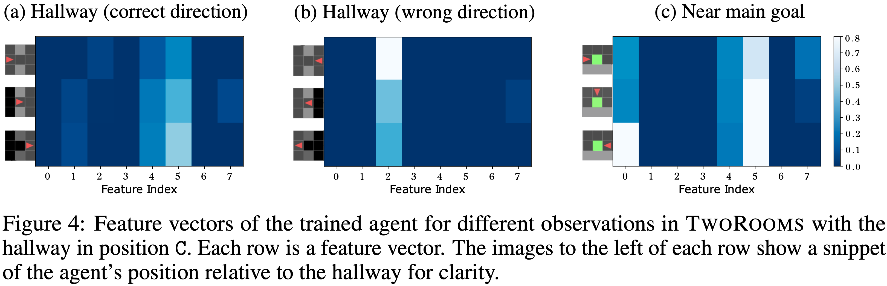

# Discovering Subgoals
This repository investigates the extraction of subgoals from representations of pixel observations. We train reinforcement learning agents equipped with different representation methods, and study whether the learned features are amenable to extract subgoals from.

## Setup
To run the code, first clone this repo and then create a virtual environment to install the required dependencies. We recommend using `venv` and Python **3.10.x**.
```
python3 -m venv venv
source venv/bin/activate
pip install -e .
pip install -r requirements.txt
```

## Usage
To train an RL agent locally, run the following command.
```
python3 discovery/experiments/FeatAct_minigrid/run_minigrid.py
```
This would train a single run of a PPO agent in a TwoRoom MiniGrid environment with the default command line arguments. Components like the number of timesteps, the learning algorithm, it's hyperparameters, the representation used, the MiniGrid env used etc. can be modified in the [config.yaml](discovery/experiments/FeatAct_minigrid/config.yaml), located in the same directory as `run_minigrid.py`. All experiments (`FeatAct_atari`, `FeatAct_climbing`) follow this script+config directory structure.

We document our analysis of these learned representations in [these notebooks](discovery/experiments/FeatAct_minigrid/analysis). For Minigrid, we have also shared the [plots](plots) from our analysis.

## Example Result
The feature vector learned by a PPO agent in a TwoRoom gridworld at and around the hallway subgoal, (a) and (b), and the main goal (c). Note features 0, 2 and 5.



## Extras
### 1. Logging with `wandb`
The `--use_wandb` flag logs the training process to a wandb dashboard. To use this feature, you must have a wandb account and be logged in on your terminal.
```
python3 discovery/experiments/FeatAct_minigrid/run_minigrid.py --use_wandb
```
[wandb_downloader.py](discovery/experiments/FeatAct_minigrid/wandb_downloader.py) and [wandb_plotter.py](discovery/experiments/FeatAct_minigrid/wandb_plotter.py) can be used to download and plot these logged runs as a camera-ready pdf for papers or reports.

### 2. Scheduling jobs with SLURM
To submit single run jobs to a SLURM scheduler, use `job-scripts/single.sh` as follows from the login-node:
```
sbatch job-scripts/single_cpu.sh
```

For larger jobs, such as hyperparameter sweeps, use `job-scripts/parent_cpu.sh` as follows:
```
sbatch job-scripts/parent_cpu.sh
```
This will submit a parent job to the SLURM scheduler, which will then submit the actual child jobs to the scheduler, modifying the training hyperparameters with each job. The child job is defined in `job-scripts/child_cpu.sh`.

All shell scripts have assoicated `*_gpu.sh` variants that request GPU resources from your cluster.

### 3. Housekeeping
All commits to this repo follow the [Conventional Commits](https://www.conventionalcommits.org/en/v1.0.0/) style wherever possible.
This repo is set to automatically use the [Black Formatter](https://marketplace.visualstudio.com/items?itemName=ms-python.black-formatter) where available. It would be lovely if future contributions can abide by it :D